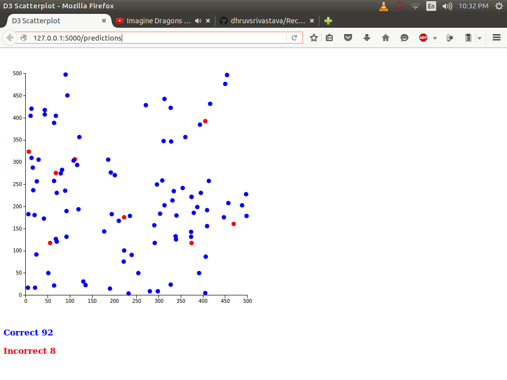
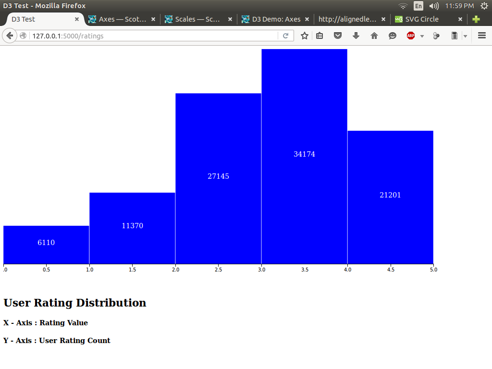

# Recommendation System
A predictive model to predict User rating for a given movie using Item-Item and User-User based Collaborative Filtering.
Data used is <a href = "http://grouplens.org/datasets/movielens/">MovieLens 100K Dataset </a>.
Algorithm uses Pearson Correlation to return a weighted sum of K nearest neighbors to predict the rating.

Algorithm selects 500 random points on the data matrix which are populated , and removes that point from the matrix to determine the prediction by the algorithm. Prediction is considered to be accurate if the maximum absolute error is 1. Achieved accuracy on the output file(output.txt) is 91.6%.

Rating Distribution of all Users on the GroupLens movie database.

